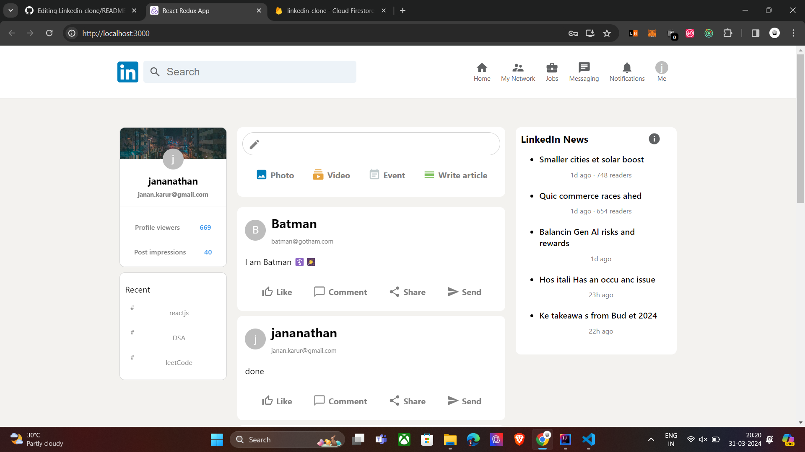
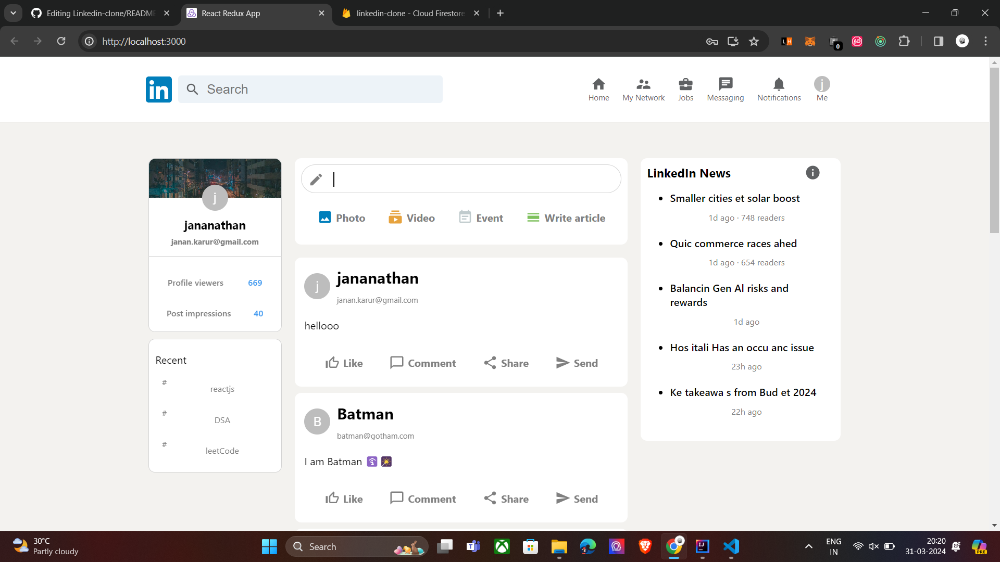

# LinkedIn Clone using Firebase, React, and Redux

This project is a clone of LinkedIn, built using Firebase for authentication, React for the frontend, and Redux for state management.

## Features

- User authentication using Firebase Authentication.
- Posting messages with attached images.
- Real-time updates using Firebase Firestore.
- Redux for managing global state.

## Screenshots




## How to Run

1. Clone this repository.
2. Navigate to the project directory.
3. Install dependencies using `npm install`.
4. Set up Firebase:
   - Create a Firebase project in the [Firebase Console](https://console.firebase.google.com/).
   - Enable Firebase Authentication and Firestore.
   - Copy your Firebase configuration.
   - Create a `.env` file in the project root and add your Firebase configuration:
     ```
     REACT_APP_FIREBASE_API_KEY=<your-api-key>
     REACT_APP_FIREBASE_AUTH_DOMAIN=<your-auth-domain>
     REACT_APP_FIREBASE_PROJECT_ID=<your-project-id>
     REACT_APP_FIREBASE_STORAGE_BUCKET=<your-storage-bucket>
     REACT_APP_FIREBASE_MESSAGING_SENDER_ID=<your-messaging-sender-id>
     REACT_APP_FIREBASE_APP_ID=<your-app-id>
     ```
5. Run the app locally using `npm start`.

## Available Scripts

In the project directory, you can run:

### `npm start`

Runs the app in the development mode.\
Open [http://localhost:3000](http://localhost:3000) to view it in your browser.

### `npm test`

Launches the test runner in the interactive watch mode.

### `npm run build`

Builds the app for production to the `build` folder.

### `npm run eject`

**Note: this is a one-way operation. Once you `eject`, you can't go back!**

## Learn More

You can learn more about Firebase, React, and Redux in their respective documentation:

- [Firebase Documentation](https://firebase.google.com/docs)
- [React Documentation](https://reactjs.org/docs/getting-started.html)
- [Redux Documentation](https://redux.js.org/introduction/getting-started)
